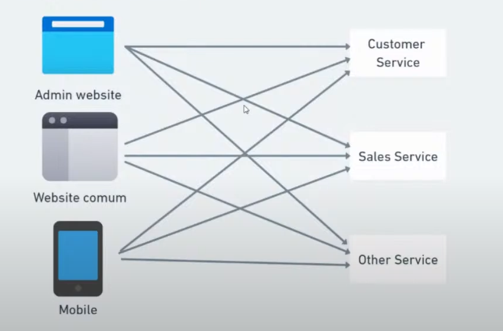
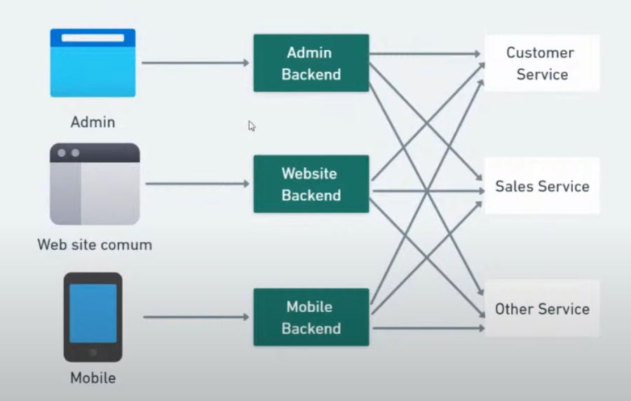
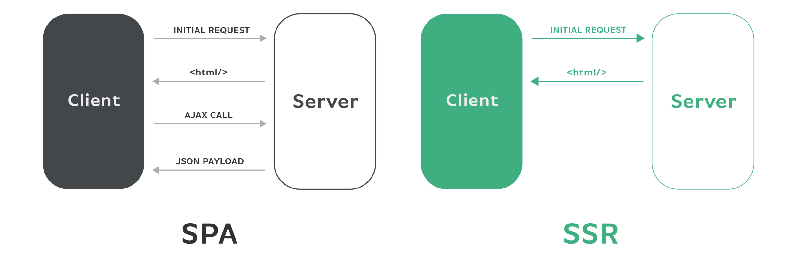
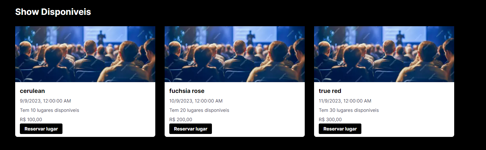
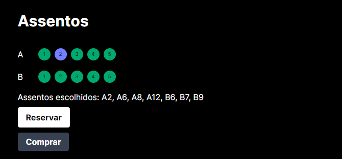
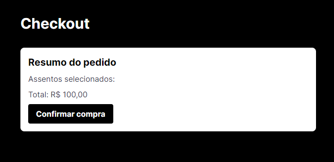

# Intensivo do Next.js e React.js

## Sistema de Vendas de Ingressos Utilizando Next.js e React.js


## Descrição do Projeto

Este projeto é uma interface de frontend para um sistema de vendas de ingressos desenvolvido com React.js e Next.js. Ele permite aos usuários pesquisar eventos, reservar assentos e realizar o pagamento dos ingressos de forma eficiente e segura.

## Funcionalidades Principais
- Pesquisa de Eventos: Permite aos usuários buscar eventos por categoria, data e localização.
- Visualização de Assentos: Exibe um mapa de assentos interativo onde os usuários podem selecionar seus lugares.
- Processo de Checkout: Facilita o pagamento seguro dos ingressos com suporte para múltiplos métodos de pagamento.
- Histórico de Compras: Permite aos usuários visualizar seu histórico de compras e status das reservas.
- Autenticação: Suporte para login e registro de usuários.
- Suporte a SEO: Otimizado para motores de busca, garantindo melhor visibilidade.

## Tecnologias Utilizadas
- React.js: Biblioteca JavaScript para construção de interfaces de usuário.
- Next.js: Framework React para renderização no servidor e geração de sites estáticos.
- TypeScript: Superset de JavaScript que adiciona tipagem estática opcional.
- Styled-Components: Biblioteca para estilos em componentes React.
- Axios: Cliente HTTP para realizar requisições a APIs.
- Express: Framework Node.js para criação de APIs e middleware.

## Pré-requisitos
- Node.js: Versão 14.x ou superior
- NPM ou Yarn: Gerenciador de pacotes

## Instalação

1. Clone o repositório:
```bash
git https://github.com/Eddiesantle/web-reactjs-with-nextjs.git
cd web-reactjs-with-nextjs
```
2. Instale as dependências:
```bash
npm install
```
3. Execute API:
```bash
npm run run-api
```
4. Execute Aplicação:
```bash
npm run dev
```

## Detalhes das Funcionalidades
### Pesquisa de Eventos
Os usuários podem buscar eventos usando o campo de busca na página inicial. A pesquisa pode ser refinada por categorias, datas e locais.

**Visualização de Assentos**
A página de detalhes do evento permite que os usuários vejam um mapa de assentos interativo. Os assentos podem ser selecionados e reservados diretamente.

**Processo de Checkout**
Após selecionar os assentos, os usuários são redirecionados para a página de checkout onde podem revisar suas escolhas e realizar o pagamento.

**Histórico de Compras**
A seção de perfil de usuário permite visualizar o histórico de compras e o status das reservas.

**Autenticação**
Suporte para login e registro utilizando tokens JWT para garantir a segurança das transações.

### Padrão Monolito



### Descrição
No padrão monolito, todas as funcionalidades de uma aplicação estão agrupadas em uma única unidade. Embora simples, este padrão pode enfrentar vários desafios à medida que a aplicação cresce.

### Problemas do padrão Monolito
- **Over fetching:** Captação excessiva de informações.
- **Over requesting:** Excesso de requisições.
- **Latência de rede:** Tempo de resposta maior devido a múltiplas requisições.
- **Segurança nos dados:** Riscos de exposição de dados sensíveis.

### Padrão Backend for Front-end



### Descrição
O padrão Backend for Front-end (BFF) introduz uma camada intermediária entre o cliente e os serviços backend, otimizando a comunicação e a segurança.


#### Single page Application - 2008 - Knockout.js | Angular.js VS Server Side Rendering - Next.js

#### O Que São SPAs?
Uma Single Page Application é um tipo de aplicação web que carrega uma única página HTML e dinamicamente atualiza o conteúdo à medida que o usuário interage com a aplicação. 

#### O Que É SSR?
No Server-Side Rendering, as páginas web são totalmente geradas no servidor antes de serem enviadas para o cliente.



| Característica                | Single Page Applications (SPAs)                                   | Server-Side Rendering (SSR)                                  |
|-------------------------------|-------------------------------------------------------------------|-------------------------------------------------------------|
| **Carregamento Inicial**      | Mais lento devido ao carregamento de scripts                      | Mais rápido com HTML pré-renderizado                        |
| **Interatividade**            | Altamente interativa, sem recarregamento de página                | Menos interativa, requer recarregamento da página           |
| **SEO**                       | Desafiador, necessita de soluções como pré-renderização ou SSR híbrido | Melhor suporte, pois o conteúdo é renderizado no servidor    |
| **Desempenho**                | Melhor para interações frequentes após o carregamento inicial     | Melhor para acesso esporádico ou conteúdos estáticos        |
| **Complexidade**              | Maior complexidade no frontend                                   | Maior carga de processamento no servidor                    |
| **Atualização de Conteúdo**   | Atualizações dinâmicas sem necessidade de recarregar a página     | Atualizações de conteúdo requerem recarregamento da página  |
| **Latência na Navegação**     | Baixa latência, navegação rápida sem recarregar a página          | Maior latência devido a solicitações completas ao servidor  |
| **Escalabilidade**            | Mais eficiente em termos de solicitação ao servidor               | Pode exigir mais recursos do servidor para cada solicitação |
| **Gerenciamento de Estado**   | Complexo, requer ferramentas específicas para estado global       | Simples, estado gerenciado no servidor para cada solicitação|
| **Manutenção e Suporte**      | Pode ser mais difícil devido à complexidade do frontend           | Mais fácil com a lógica principal mantida no backend        |
| **Exemplo de Frameworks**     | Angular.js, React, Vue.js                                        | Next.js, Nuxt.js, frameworks baseados em PHP, Java, etc.    |
| **Uso de Recursos do Cliente**| Alto, pois a lógica da aplicação é executada no navegador         | Menor, pois a maior parte do processamento é feita no servidor |
| **Dependência de JavaScript** | Alta, a aplicação depende fortemente de JavaScript                | Baixa a moderada, já que o HTML é pré-renderizado no servidor |
| **Experiência Offline**       | Suportado através de PWA, caches e outras tecnologias             | Limitado, depende do cache do navegador e outras tecnologias server-side |
| **Métricas e Monitoramento**  | Complexo, necessita de ferramentas para capturar eventos do frontend | Mais direto, a maior parte das métricas é capturada no backend |

## Criando um Projeto Next.js com TypeScript Pratica e implementação

Para criar um projeto Next.js já configurado com TypeScript, siga os passos abaixo:


### Instalação
```bash
npx create-next-app --typescript
```

Instalar express
```bash
npm install express
```

### Comandos de Execução
No arquivo package.json, adicione os seguintes scripts para gerenciar a execução da API e da aplicação Next.js:

```package.json
"scripts": {
    "dev": "next dev",
    "build": "next build",
    "start": "next start",
    "lint": "next lint",
    "run-api": "node node-api/api.js"
  },
```

Para iniciar a API, execute:
```bash
npm run run-api
```

### Práticas de Cache

Para utilizar o cache com validação em revalidação, use o seguinte exemplo:

//stale while revalidate
```javascript
const response = await fetch('http://localhost:8000/events', {
    cache: "no-store", // Sem cache nenhum
    next: {
      revalidate: 10 // segundos
    }
  })
```

### Componentes do Next.js

- Server Components
    - Os componentes do servidor podem ser assíncronos e não possuem interatividade no cliente.
- Client Components
    - Componentes no cliente são utilizados para interatividade e dependem de JavaScript.

//cache fosse atualizado baseado em quando houvesse novas vendas de ingressos,
//ou os dados dos eventos foram alterados

revalidateTag

### Screenshots

- Página Inicial


- Reservar Assentos


- Checkout


### Contribuições

Contribuições são bem-vindas! Para contribuir com o projeto, siga os passos abaixo:

1. Fork o repositório.
2. Crie uma branch para suas alterações (git checkout -b feature/nova-funcionalidade).
3. Commit suas alterações (git commit -m 'Adiciona nova funcionalidade').
4. Envie para o branch (git push origin feature/nova-funcionalidade).
5. Abra um Pull Request.